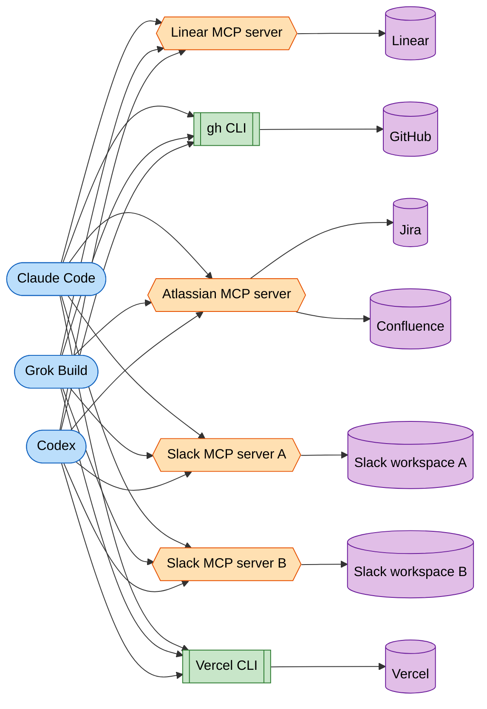
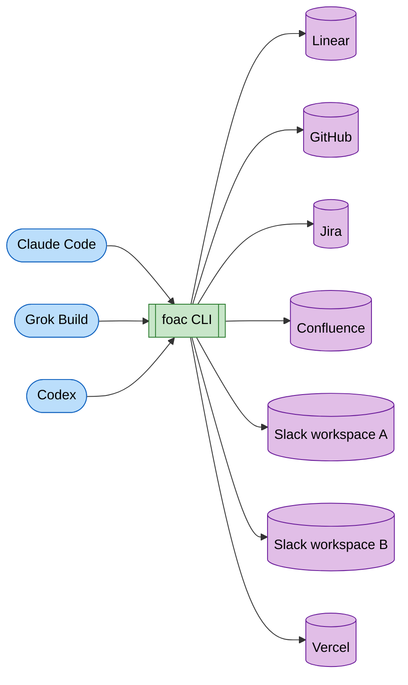

<picture>
  <source media="(prefers-color-scheme: dark)" srcset="assets/brand/readme/foac-readme-header-dark.svg">
  <source media="(prefers-color-scheme: light)" srcset="assets/brand/readme/foac-readme-header-light.svg">
  
</picture>

# foac

foac, the Father Of All CLIs: one CLI for all your SaaS providers (Linear,
GitHub, Jira, Confluence, Neon, Sentry, Slack, Vercel, and more on the way),
built for the coding agents on your machine rather than for you. Install it
once, log in once, and every harness (Claude Code, Cursor, Codex, Gemini CLI,
Grok Build, ...) can use all your providers without any setup of its own. Humans
at a TTY get readable tables from the same commands.

If your agents spend their context loading MCP tool catalogs and fetching API
docs, foac replaces all of that with a single binary that already knows the
APIs.

## Install

With [Homebrew](https://brew.sh), on macOS or Linux:

```sh
brew install alephic-ai/tap/foac
```

Homebrew owns the binary it installs, so keep it current with `brew upgrade
foac` rather than `foac update`.

With [mise](https://mise.jdx.dev), on macOS, Linux, or Windows:

```sh
mise use -g github:alephic-ai/foac
```

That installs the `foac` binary from
[GitHub Releases](https://github.com/alephic-ai/foac/releases) and puts it on
your `PATH`; `foac update` keeps it current after that.

## The picture

Without foac, every harness wires up its own adapters — a mix of MCP servers
and one-off CLIs, each with its own config and its own copy of your tokens:



Three harnesses and six adapters is already eighteen integrations to
configure and keep authenticated — a second Slack workspace alone means its
own MCP server configured in every harness — and that's before counting the
rest of your harnesses and providers. Every harness or adapter you add
multiplies that number.

With foac, install once and log in once; every harness talks to every
provider through the same binary — even to several instances of the same
provider, like two Slack workspaces:



## Why harnesses like foac

- **Install once, auth once, share everywhere.** `foac auth <provider> login`
  validates and stores your token. Every harness and script on the machine
  reuses the same auth and the same provider settings, so a new harness needs
  no configuration at all. See [doc/auth.md](doc/auth.md).
- **Discovery is instant and offline.** foac is a local cache of your
  providers' APIs. Every command tree is compiled into the binary, so an
  agent learns an API through `--help` without a network round-trip or a doc
  lookup, and without spending tokens on either.
- **A grammar agents can guess.** An MCP server pushes its whole tool catalog
  into the context before the first call. foac has one consistent hierarchy,
  `foac <provider> <resource> <verb>`, and every provider follows it, so an
  agent discovers commands progressively and only reads what the task needs.
  Knowing `foac linear user list` exists is knowing `foac slack user list`
  exists.
- **Several tenants of one provider, side by side.** Log in to two Slack
  workspaces or Atlassian sites as named instances and address either one
  from any folder; see [doc/auth.md](doc/auth.md).
- **The CLI shrinks and grows with what you enable.** Disabled or
  unauthenticated providers disappear from `--help` and from the installed
  agent skills, so they never take up context. Toggle providers globally or
  per project without touching auth: each project can run with a different
  set of providers, and re-enabling one never asks you to log in again.
- **Composable.** Compact JSON on stdout, errors as JSON on stderr with exit
  code 1, so foac commands chain like any Unix tool. Better: pipe one provider's
  `list` straight into another's `get` and foac does the join itself — `--from`
  names the field to match on, no `jq` or `xargs` glue needed:

  ```sh
  # Look up the Slack profile of every Linear user, matching on email
  $ foac linear user list | foac slack user get --from email
   id          | name  | ok   | real_name    | tz
  -------------+-------+------+--------------+------------------
   U0200000001 | ada   | true | Ada Lovelace | Europe/London
   U0200000002 | grace | true | Grace Hopper | America/New_York

  # Piped onward it's one JSON document per result, so jq keeps composing
  $ foac linear user list | foac slack user get --from email | jq -r '.user.real_name'
  Ada Lovelace
  Grace Hopper
  ```

- **Responses are the provider's raw JSON.** foac does not reshape what an
  API returns, so the upstream API docs describe foac's output too. Every
  list command paginates the same way, with the same flags, across all
  providers.
- **Self-installing agent skills.** `foac skill install` writes one skill per
  active provider for Claude Code and every agent reading
  `~/.agents/skills/`, and removes the skills of inactive providers. See
  [doc/agent-skills.md](doc/agent-skills.md).
- **Self-updating.** `foac update` pulls the latest release for your platform
  and refreshes any installed foac skills.

## Providers

| Provider | Covers | Docs |
| --- | --- | --- |
| Linear | Issues, projects, teams, users, cycles, labels, workflow states, documents, initiatives, milestones, status updates, attachments | [doc/linear.md](doc/linear.md) |
| GitHub | Repositories, issues, pull requests, reviews, Actions, branches, commits, checks, releases, labels, artifacts, collaborators | [doc/github.md](doc/github.md) |
| Jira | Issues, comments, projects, sprints, users, workflow transitions | [doc/jira.md](doc/jira.md) |
| Confluence | Spaces, pages, footer comments, CQL search | [doc/confluence.md](doc/confluence.md) |
| Neon | Organizations, projects, branches, databases, roles, compute endpoints, operations, connection URIs | [doc/neon.md](doc/neon.md) |
| Sentry | Organizations, projects, issues, error events, releases | [doc/sentry.md](doc/sentry.md) |
| Slack | Conversations, messages, threads, users, message search, reactions | [doc/slack.md](doc/slack.md) |
| Vercel | Teams, projects, deployments, account domains, project domains | [doc/vercel.md](doc/vercel.md) |

Candidates for more providers are tracked in
[GitHub issues](https://github.com/alephic-ai/foac/issues).

## Quick start

```sh
foac auth linear login                                # once, for every harness
foac skill install                                    # teach your agents foac
foac linear issue list --team ENG --state "In Progress"
foac provider disable slack                           # auth stays; re-enable anytime
foac update
```

`foac update` downloads the latest GitHub release for this platform, replaces
the running binary, and refreshes any foac provider skills already installed.

foac stores editable provider settings in
`~/.config/foac/config.toml` and machine-managed credentials in
`~/.config/foac/credentials.json` (or the equivalent paths under
`XDG_CONFIG_HOME`). The credentials file is atomically replaced and kept mode
`0600` on Unix.

To toggle providers per project, drop a `.foac.toml` in the project folder:

```toml
enabled_providers = ["linear"]        # on here even if disabled globally
disabled_providers = ["slack@workb"]  # off here; bare "slack" would disable all instances

[defaults]
slack = "workb"                       # unqualified slack commands here use workb
```

foac uses the nearest `.foac.toml` found from the working directory up to `/`;
its toggles override the global ones, and auth is never affected.
`foac provider <enable|disable> <name> [--instance <name>] --local` edits that
nearest file for you, creating `./.foac.toml` when none exists.

Each provider can hold several named instances — independent logins to
different tenants, like two Slack workspaces (`foac auth slack login
--instance workb`, then `foac slack conversation list -i workb`). The
unnamed login is the `default` instance, used when no instance is selected;
see [doc/auth.md](doc/auth.md).

Other commands check GitHub for a newer release at most once a day, and print a
notice on stderr while one exists. They never auto-install. Set
`FOAC_NO_UPDATE_CHECK` (or `CI`) to skip the check.

Humans get auto-rendered tables at an interactive terminal instead of JSON;
see [doc/output.md](doc/output.md).
