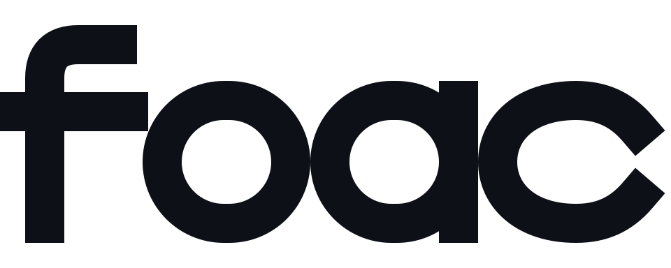
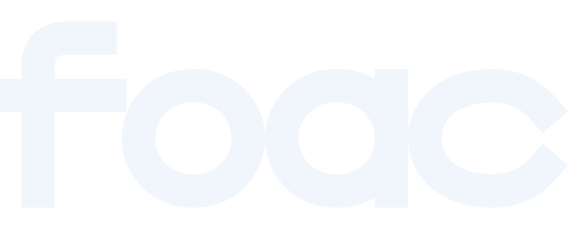
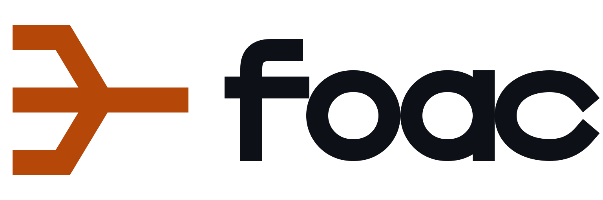
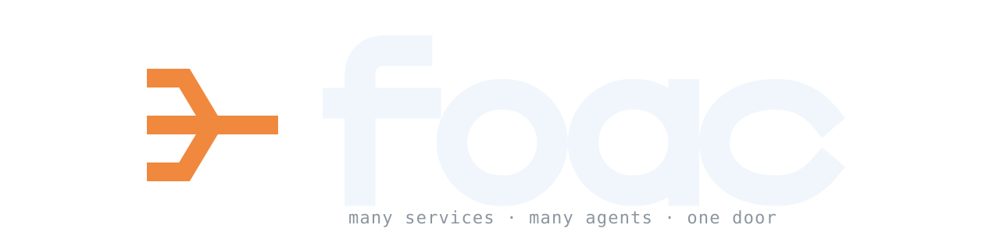
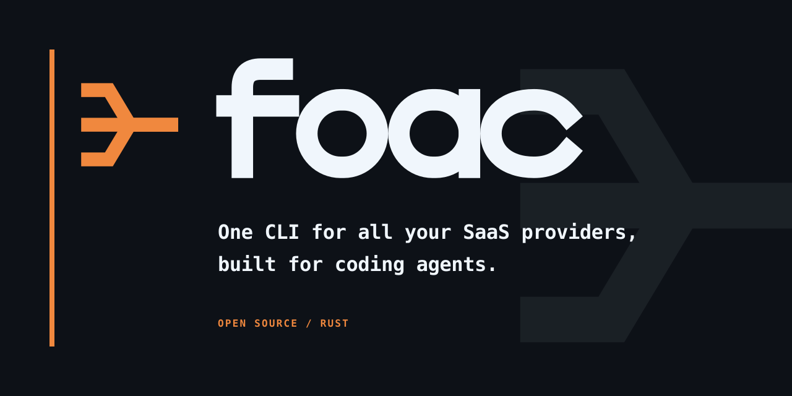

# foac brand assets

The identity is built from the **Merge** mark: three input rails resolve into
one dependable output. It follows the Convergence territory from the identity
brief.

## Palette

- Ink: `#0d1117`
- Reverse: `#f0f6fc`
- Oxide on light: `#b54708`
- Amber on dark: `#f0883e`
- GitHub dark background: `#0d1117`

Every asset remains readable as a single-color silhouette. The two oranges are
theme-specific contrast adjustments, not gradients.

## Icon / avatar

512 × 512 masters, plus literal 16/32 px favicon exports.

| On light | On dark | One color |
| :---: | :---: | :---: |
|  |  |  |
| [SVG](icon/foac-icon-on-light.svg) · [PNG 512](icon/foac-icon-on-light-512.png) | [SVG](icon/foac-icon-on-dark.svg) · [PNG 512](icon/foac-icon-on-dark-512.png) | [SVG](icon/foac-icon-one-color.svg) · [PNG 512](icon/foac-icon-one-color-512.png) |

Favicon: [SVG master](icon/foac-favicon.svg) · [16 px](icon/favicon-16.png) ·
[32 px](icon/favicon-32.png)

  

## Wordmark + lockup

Custom lowercase vector lettering.

| Wordmark on light | Wordmark on dark |
| :---: | :---: |
|  |  |
| [SVG](wordmark/foac-wordmark-on-light.svg) · [PNG](wordmark/foac-wordmark-on-light.png) | [SVG](wordmark/foac-wordmark-on-dark.svg) · [PNG](wordmark/foac-wordmark-on-dark.png) |

| Lockup on light | Lockup on dark |
| :---: | :---: |
|  |  |
| [SVG](wordmark/foac-lockup-on-light.svg) · [PNG](wordmark/foac-lockup-on-light.png) | [SVG](wordmark/foac-lockup-on-dark.svg) · [PNG](wordmark/foac-lockup-on-dark.png) |

## README headers

1280 × 320, transparent theme variants.

| Light | Dark |
| :---: | :---: |
|  |  |
| [SVG](readme/foac-readme-header-light.svg) · [PNG](readme/foac-readme-header-light.png) | [SVG](readme/foac-readme-header-dark.svg) · [PNG](readme/foac-readme-header-dark.png) |

## GitHub social preview

1280 × 640, important content inside the 78 px safe margins.



[SVG master](social/foac-social-card.svg) ·
[PNG 1280 × 640](social/foac-social-card.png)

## README usage

```html
<picture>
  <source media="(prefers-color-scheme: dark)" srcset="assets/brand/readme/foac-readme-header-dark.svg">
  <source media="(prefers-color-scheme: light)" srcset="assets/brand/readme/foac-readme-header-light.svg">
  
</picture>
```

## Notes

- Keep the wordmark lowercase: `foac`.
- Use the on-light assets on white or very pale backgrounds.
- Use the on-dark assets on `#0d1117` or similarly dark backgrounds.
- The favicon has an opaque dark background so it remains visible in both light
  and dark browser chrome.
- SVG files are the masters; PNG files are exports from those masters.
- No gradients, sparkles, provider logos, robots, or boxed terminal prompts. The
  identity remains a single-color geometric system.
