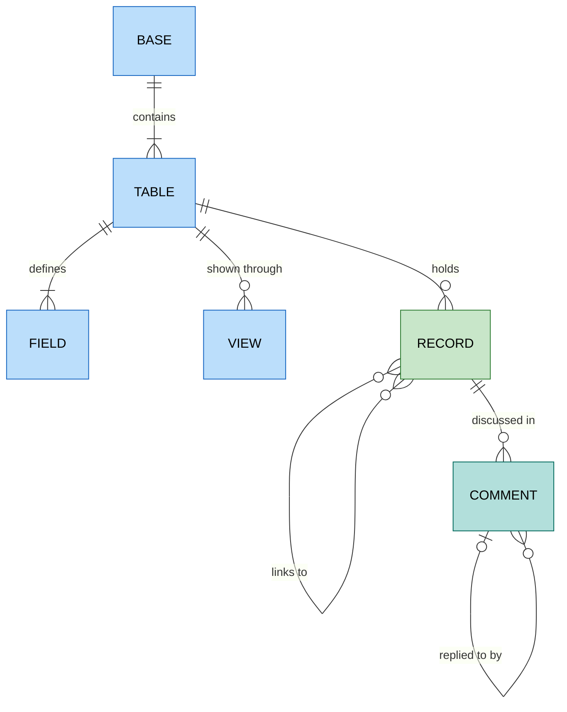

# Airtable

`foac airtable` talks to [Airtable's Web API](https://airtable.com/developers/web/api/introduction).
It uses `AIRTABLE_API_KEY` or a credential saved by
`foac auth airtable login`: a personal access token created at
<https://airtable.com/create/tokens>. A token sees only the bases it was
granted, within its scopes: `data.records:read`/`write` for records,
`data.recordComments:read`/`write` for comments, `schema.bases:read` for
`base list` and `table list`, and optionally `user.email:read` so
`foac auth status` shows your email. A base outside the token's reach, or a
missing scope, answers 403 `INVALID_PERMISSIONS_OR_MODEL_NOT_FOUND`.

Records and comments are addressed by `--base` (an `app...` ID) and `--table`
(a `tbl...` ID or the table name; IDs survive renames). `table list` returns
the base schema: every table with its `fields[]` and `views[]`. Record
`fields` are Airtable's raw cell values keyed by field name; empty cells are
omitted.

```sh
export AIRTABLE_API_KEY=pat...
foac airtable base list
foac airtable table list --base appAbc123
foac airtable record list --base appAbc123 --table Tasks --view "Open" --formula "{Owner} = 'Lolo'" --field Name --field Due
foac airtable record list --base appAbc123 --table Tasks --sort '[{"field": "Due", "direction": "desc"}]'
foac airtable record get --base appAbc123 --table Tasks recXyz789
foac airtable record create --base appAbc123 --table Tasks --fields '{"Name": "Ship it", "Status": "Todo"}' --typecast
foac airtable record update --base appAbc123 --table Tasks recXyz789 --fields '{"Status": "Done"}'
foac airtable record delete --base appAbc123 --table Tasks recXyz789
foac airtable comment create --base appAbc123 --table Tasks recXyz789 --body "Done, see PR #42"
foac airtable --help
```

`record update` sends a PATCH: only the given fields change. `--typecast`
converts string values to the field type and creates missing select options.

Every list prints `{"items":[...],"pageInfo":{...}}`. `base list`,
`record list`, and `comment list` paginate with `--after` using
`pageInfo.endCursor`; `record list` and `comment list` also take `--limit`
(default 50, at most 100). `base list` pages are 1000 bases; `table list` is
one page.

Not covered: base, table, and field creation or changes, batch and upsert
writes, attachment uploads, comment edits and deletes, interfaces, and
webhooks.

## Entity relationships

Entities exposed by the CLI and how they relate.


