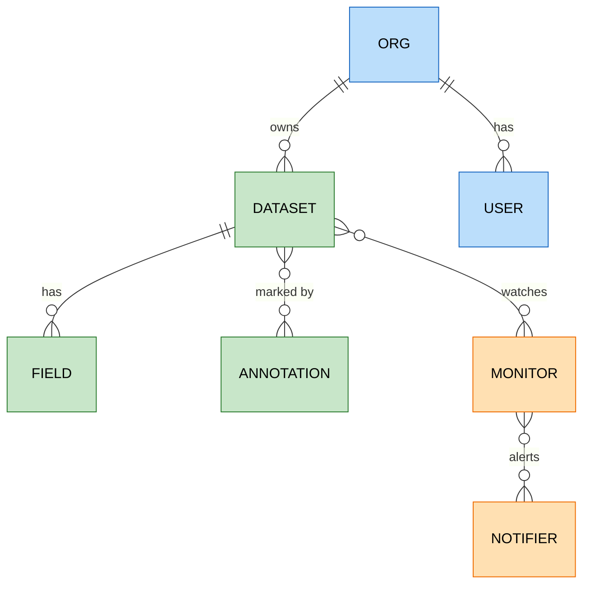

# Axiom

`foac axiom` talks to [Axiom's REST API](https://axiom.co/docs/restapi/introduction):
datasets and their fields, APL queries, event ingestion, annotations,
monitors, notifiers, users, and organizations. It uses `AXIOM_TOKEN` or a
credential saved by `foac auth axiom login`. Datasets are identified by
name everywhere (the name is also the dataset's `id`).

Axiom has two token kinds. An API token (`xaat-`, Settings > API tokens)
carries its own organization and permissions and is what Axiom recommends.
Create it with Advanced permissions and grant only what you use:

| foac commands | Permission |
| --- | --- |
| `ingest` | All datasets (or individual ones): Ingest, create |
| `query` | All datasets (or individual ones): Query, read |
| `dataset trim` | All datasets (or individual ones): Trim, update |
| `dataset`, `field` | Org level: Datasets, create/read/update/delete as used |
| `annotation` | Org level: Annotations, create/read/update/delete as used |
| `monitor`, `notifier`, `user` | Org level: Monitors, Notifiers, Users, read |

A personal access token (`xapt-`, Settings > Profile) acts as you across
organizations, so it also needs the organization ID: pass `--org-id ID`
anywhere after `axiom` or set `AXIOM_ORG_ID`. `AXIOM_URL` overrides the API
base URL (`https://api.axiom.co`) for the default instance only.

```sh
export AXIOM_TOKEN=xaat-...
foac axiom dataset list
foac axiom field list --dataset logs
foac axiom query "['logs'] | where level == 'error' | where _time > ago(1h) | limit 20"
foac axiom ingest logs --events-file events.ndjson --timestamp-field ts
foac axiom annotation create --type deploy --dataset logs --title "v1.2.0" --url https://github.com/owner/repo/pull/42
foac axiom monitor history mon_123 --start-time 2026-08-01T00:00:00Z --end-time 2026-08-30T00:00:00Z
foac axiom --help
```

## Queries

`query` posts an APL query to `/v1/datasets/_apl` (tabular format) and
prints it as a foac list: Axiom returns each table column-major (`fields[]`
names and `columns[c][r]` values), which is unreadable as-is, so foac
transposes it into `items`, one object per row keyed by the query's output
fields. This is the one reshaping in the provider. `pageInfo` carries
`hasNextPage` (more rows matched than returned) plus Axiom's `minCursor` /
`maxCursor`, and `status` is Axiom's raw query status (`rowsMatched`,
`elapsedTime`, `messages`, ...). Time ranges go in the query
(`where _time > ago(1h)`) or in `--start-time` / `--end-time` as RFC 3339.
To page, sort by `_time`, then pass `pageInfo.maxCursor` (ascending) or
`pageInfo.minCursor` (descending) back through `--cursor`, adding
`--include-cursor` to keep the boundary event.

## Ingest

`ingest DATASET` takes `--events JSON` or `--events-file PATH` (`-` reads
stdin) holding a JSON array, a single object, or NDJSON, and posts them as
one batch to `/v1/datasets/{name}/ingest`. `--timestamp-field` and
`--timestamp-format` tell Axiom where each event's time lives. The response
is Axiom's ingest status (`ingested`, `failed`, `failures`, ...).

## Lists

Management lists (`dataset`, `field`, `annotation`, `monitor`, `notifier`,
`user`, `org`) print `{"items":[...],"pageInfo":{"hasNextPage":false}}`:
Axiom returns them whole, with no pagination parameters. `annotation list`
filters with repeatable `--dataset` and `--start`/`--end`; `monitor history`
requires `--start-time` and `--end-time`. Monitors and notifiers are
read-only; API tokens, dashboards, virtual and map fields, saved queries,
views, roles and groups, live streaming, and CSV ingest are not covered.

## Entity relationships


