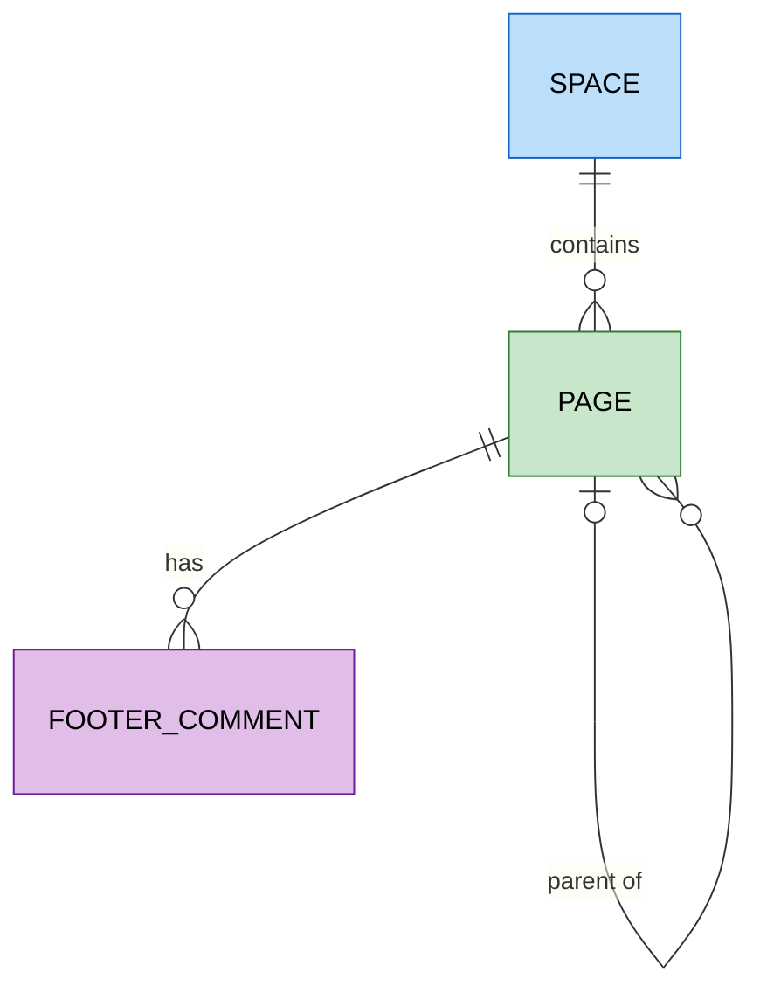

# Confluence

`foac confluence` talks to [Confluence Cloud's REST API v2](https://developer.atlassian.com/cloud/confluence/rest/v2/)
for spaces, pages, and footer comments, and to the v1 root for CQL search
(the one endpoint Atlassian never ported to v2). It shares the vendor-level
`atlassian` credential with [Jira](jira.md), each value resolved
independently as flag, then environment, then stored value:

- host: `--host`, `ATLASSIAN_HOST` (like `acme.atlassian.net`), stored
- email: `--email`, `ATLASSIAN_EMAIL`, stored
- API token: `ATLASSIAN_API_TOKEN`, stored, or piped to stdin (never a flag,
  to keep it out of shell history)

`foac auth confluence login` prompts for all three, validates them against
the Confluence API, and stores them as the shared `atlassian` credential, so
logging in through either Jira or Confluence covers both — and logging out of
either removes the credential for both. Piped logins read one line per
missing value in host, email, token order; pass `--host` and `--email` to
send only the token. Because the credential is shared, a Jira-only tenant
shows Confluence as authenticated and its commands fail at request time with
the API's own error.

```sh
export ATLASSIAN_HOST=acme.atlassian.net
export ATLASSIAN_EMAIL=user@example.com
export ATLASSIAN_API_TOKEN=...
foac confluence page list --space ENG
foac confluence search --cql 'type = page AND text ~ "login"'
foac confluence --help
```

Spaces accept a key like `ENG` or a numeric ID; pages and comments use
numeric IDs. Page and comment bodies are written as Confluence wiki markup
via `--body`/`--body-file` and read back in the storage representation.
`page update` and `comment update` fetch the current version internally and
re-send omitted fields unchanged (the v2 PUT requires status, title, and body
alongside the incremented version), so there is no version flag to manage.

List commands print `{"items":[...],"pageInfo":{...}}`. `space`, `page`, and
`comment` lists paginate with `--after` using `pageInfo.endCursor`; `search`
paginates with `--start-at` using `pageInfo.nextStartAt`.

Out of scope: attachments as binary transfer, whiteboards and databases,
page permissions, and Data Center-specific APIs.

## Entity relationships

Entities exposed by the CLI and how they relate; pages form a tree within
their space via `--parent`.


