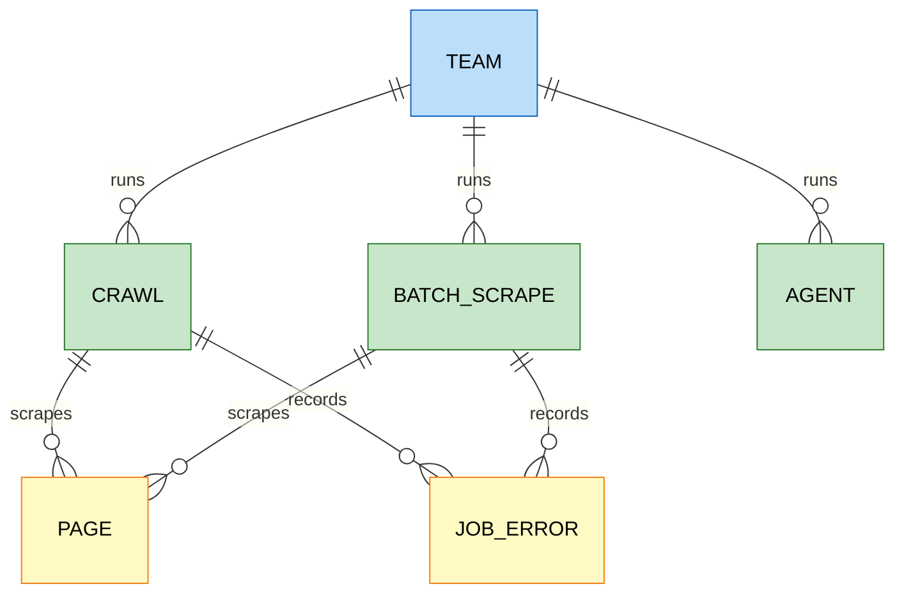

# Firecrawl

`foac firecrawl` talks to [Firecrawl's v2 API](https://docs.firecrawl.dev/api-reference/introduction).
It uses `FIRECRAWL_API_KEY` or a credential saved by `foac auth firecrawl
login`. At an interactive terminal, login first asks for the host (default
`api.firecrawl.dev`; enter your own for a self-hosted deployment, keeping an
explicit `http://` for a local Docker instance) and saves it alongside the
token; piped logins read only the token, so pass `--host http://localhost:3002`
to save a self-hosted host non-interactively. The host is stored with the
instance's credentials, so the cloud API and a self-hosted Firecrawl can
coexist as named instances (see [auth.md](auth.md)); a self-hosted deployment
with authentication disabled accepts any non-empty token. `FIRECRAWL_API_URL`
overrides the saved host for the default instance only. `scrape`, `map`, and
`search` answer synchronously. `crawl`, `batch-scrape`, and `agent` are
jobs: `create` returns an ID, `get` reads the status and scraped pages,
`cancel` stops it, and `create --wait` polls until the job settles.

```sh
export FIRECRAWL_API_KEY=fc-...
foac firecrawl scrape https://docs.example.com/api --formats markdown,links
foac firecrawl scrape https://example.com/pricing --json-prompt "List each plan and its monthly price"
foac firecrawl map https://docs.example.com --search authentication
foac firecrawl search "rust async runtime comparison" --limit 5 --tbs qdr:y
foac firecrawl crawl create https://docs.example.com --limit 50 --include-paths "/docs/*" --wait
foac firecrawl agent create "List the pricing tiers" --url https://example.com/pricing --wait
foac firecrawl team credit-usage
foac firecrawl --help
```

`scrape` prints Firecrawl's raw `{"success": true, "data": {...}}`, one key
per requested format (`markdown` by default; `html`, `rawHtml`, `links`,
`images`, `screenshot`, `summary`, `branding`, `attributes`,
`changeTracking`, and `json` for structured extraction guided by
`--json-prompt` and `--json-schema`/`--json-schema-file`). The same
per-page flags apply to `crawl create` and `batch-scrape create`.

`map`, `search`, and `crawl list` print single-page foac lists,
`{"items":[...],"pageInfo":{"hasNextPage":false}}`, so they pipe into
`scrape --from url`:

```sh
foac firecrawl map https://docs.example.com --search auth | foac firecrawl scrape --from url
foac firecrawl search "site:example.com pricing" | foac firecrawl scrape --from url --formats links
```

`search` flattens the requested `--sources` (web by default; news, images)
into one list, web first. A job status carries a `next` URL when it holds
more pages than one response; pass its `skip` value to `get --skip`.

Credits are spent per page scraped and agents also spend tokens; `team
credit-usage`, `team token-usage`, `team queue-status`, and `team
concurrency` report the balance and load. Not covered: local file parsing
(`/v2/parse`, a file upload), monitors, browser sessions, and page
interaction; the deprecated `/v2/extract` is replaced by `scrape`'s `json`
format.

## Entity relationships

Entities exposed by the CLI and how they relate. `scrape`, `map`, and
`search` return their result directly; jobs are the only stored entities,
and every job produces pages shaped like a scrape result.


