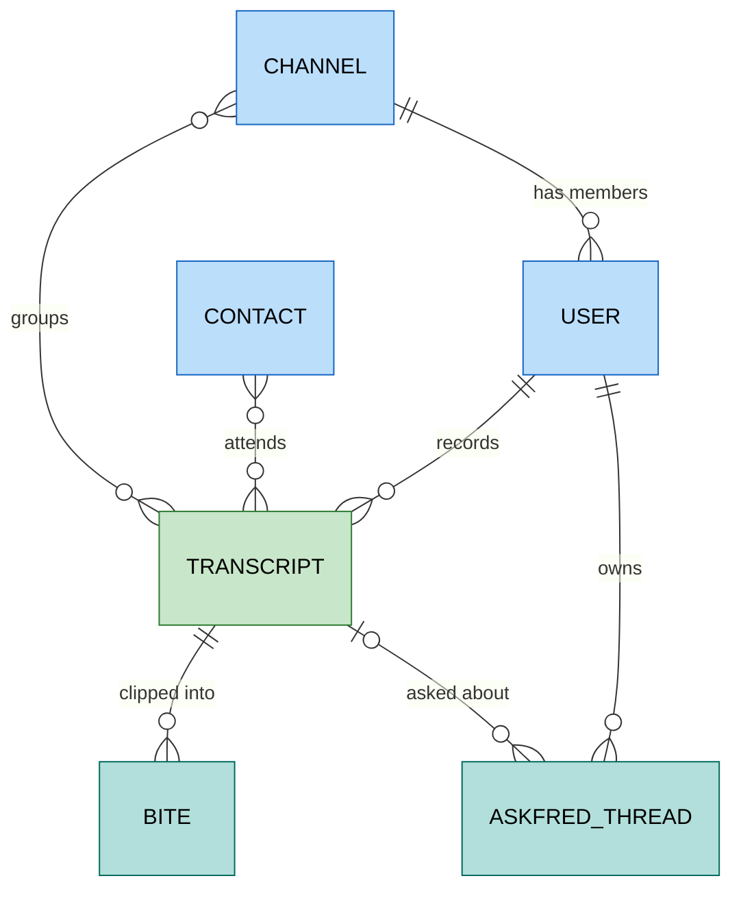

# Fireflies

`foac fireflies` talks to the
[Fireflies.ai GraphQL API](https://docs.fireflies.ai/getting-started/introduction).
It uses `FIREFLIES_API_KEY` or a credential saved by
`foac auth fireflies login`; copy the key from
[Integrations > Fireflies API](https://app.fireflies.ai/integrations/custom/fireflies).

`transcript list` returns meeting metadata; `transcript get ID` adds
attendees, channels, and the AI summary (overview, action items, keywords,
outline). `--sentences` adds the spoken transcript, which is large.
`askfred create "QUESTION"` asks Fireflies' AI about one meeting
(`--transcript ID`) or across meetings filtered by time, organizer,
participant, or channel; follow up with `askfred continue THREAD_ID`.
`user get me` is the API key's owner.

```sh
export FIREFLIES_API_KEY=...
foac fireflies transcript list --from-date 2026-09-01T00:00:00.000Z --participant alex@example.com
foac fireflies transcript list --keyword pricing --scope sentences
foac fireflies transcript get 01K2EXAMPLE --sentences
foac fireflies askfred create "What did we decide about the Q4 launch?" --start-time 2026-09-01T00:00:00Z
foac fireflies askfred continue THREAD_ID "Who owns the follow-ups?"
foac fireflies user get me
foac fireflies --help
```

List commands print `{"items":[...],"pageInfo":{...}}`. `transcript list`
and `bite list` page with `--limit` (at most 50) and `--start-at`, following
`pageInfo.nextStartAt`; other lists return everything at once. Gets and
mutations print Fireflies' raw GraphQL `data`. Fireflies rate-limits by plan
(50 requests a day on Free, 500 on Pro, 60 a minute on Business), so filter
rather than page through everything.

Audio and video URLs and meeting analytics need a paid plan and are never
requested, because one gated field fails the whole query on a Free plan.
Live meetings (adding the bot, pausing recording, live action items and
soundbites), sharing and privacy changes, bite creation, AI App outputs,
analytics, audit events, user roles, and webhooks are not covered.

## Entity relationships

Entities exposed by the CLI and how they relate.


