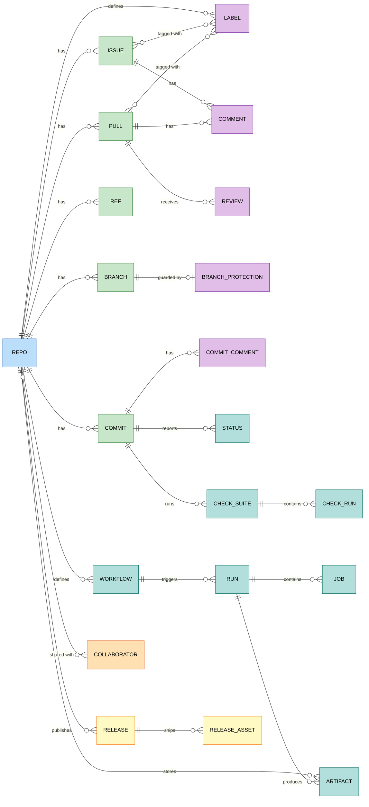

# GitHub

`foac github` talks to GitHub.com's REST API. It uses `GITHUB_TOKEN`, a
credential saved by `foac auth github login`, or `gh auth token`, in that order.
Repository-scoped commands accept `--repo OWNER/NAME` anywhere after the
resource name; without it, foac uses the current checkout's GitHub remote.
`repo list` is account-wide and takes no `--repo`.

For classic tokens, the `repo` scope covers private-repository commands. For
fine-grained tokens, grant Metadata read plus read or write access (matching the
commands you will use) to Issues, Pull requests, Actions, Checks, Commit
statuses, Contents, and Administration. Branch protection and collaborator
changes require Administration write access.

GitHub App installation tokens need Contents write to read a repository's
merge settings (`allow_squash_merge` and friends); without it those fields are
omitted from `repo get`.

```sh
export GITHUB_TOKEN=github_pat_...
foac github issue list --repo owner/repo --state open
foac github pull get 14 --repo owner/repo
foac github run list --repo owner/repo --status failure
foac github --help
```

GitHub list commands print `{"items":[...],"pageInfo":{...}}` and accept
`--limit`/`--page`. Commands with long Markdown fields accept either `--body`
or `--body-file`. Asset and artifact commands return metadata only; binary
transfer and Actions log retrieval are unsupported.

## Entity relationships

Entities exposed by the CLI and how they relate. Everything except
`repo list` is rooted at one repository. Issues and pull requests share a
single comment store, so `issue comment` commands work on both.


