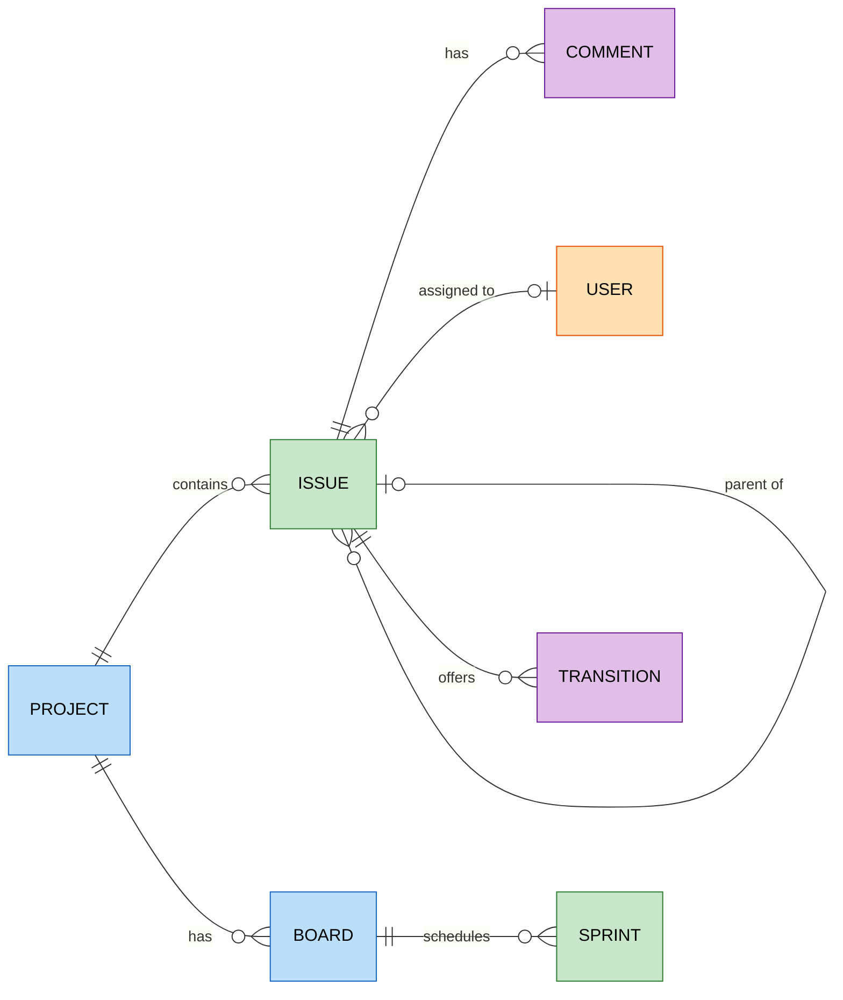

# Jira

`foac jira` talks to
[Jira Cloud's REST API v2](https://developer.atlassian.com/cloud/jira/platform/rest/v2/)
(plain-text bodies instead of v3's Atlassian Document Format) and the Agile 1.0
API for sprints. Every command needs three Atlassian credentials, each resolved
independently as flag, then environment, then stored value:

- host: `--host`, `ATLASSIAN_HOST` (like `acme.atlassian.net`), stored
- email: `--email`, `ATLASSIAN_EMAIL`, stored
- API token: `ATLASSIAN_API_TOKEN`, stored, or piped to stdin (never a flag,
  to keep it out of shell history)

`foac auth jira login` prompts for all three, validates them against the Jira
API, and stores them as the vendor-level `atlassian` credential (the same API
token works for Confluence). Piped logins read one line per missing value in
host, email, token order; pass `--host` and `--email` to send only the token.

```sh
export ATLASSIAN_HOST=acme.atlassian.net
export ATLASSIAN_EMAIL=user@example.com
export ATLASSIAN_API_TOKEN=...
foac jira issue list --jql 'project = ENG AND statusCategory != Done'
foac jira issue transition ENG-123 --to "In Progress"
foac jira --help
```

Issues use keys like `ENG-123`; projects accept a key or numeric ID; issue
types and priorities a name or numeric ID; assignees are account IDs
(`foac jira user list --query someone@example.com`); `sprint list --board`
takes a numeric board ID or an exact board name. Descriptions and comments
use `--body`/`--body-file`.

List commands print `{"items":[...],"pageInfo":{...}}`. `issue list`
paginates with `--after` using `pageInfo.nextPageToken`; every other list
paginates with `--start-at` using `pageInfo.nextStartAt`.

## Entity relationships

Entities exposed by the CLI and how they relate. `board list` is global and
`sprint list` takes `--board`; the board→project edge exists in Jira but is
not queried by the CLI.


