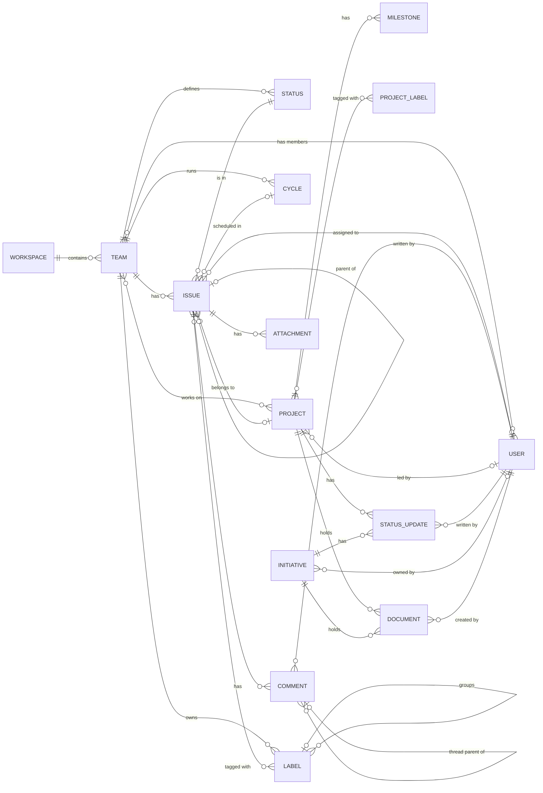

# Linear

`foac linear` talks to [Linear's GraphQL API](https://linear.app/developers/graphql). It uses `LINEAR_API_KEY` or a credential saved by `foac auth linear login`. Every command prints JSON on stdout; list commands paginate with `--limit`/`--after` and include `pageInfo` in the output.

```sh
export LINEAR_API_KEY=lin_api_...
foac linear issue list --team ENG --state "In Progress"
foac linear issue create --team <TEAM_UUID> --title "Fix the flux capacitor"
foac linear --help
```

## Entity relationships

Entities exposed by the CLI and how they relate. A status update and a
document each belong to a project or an initiative, never both; the CLI
enforces the exclusivity. The project↔initiative edge is not exposed.


