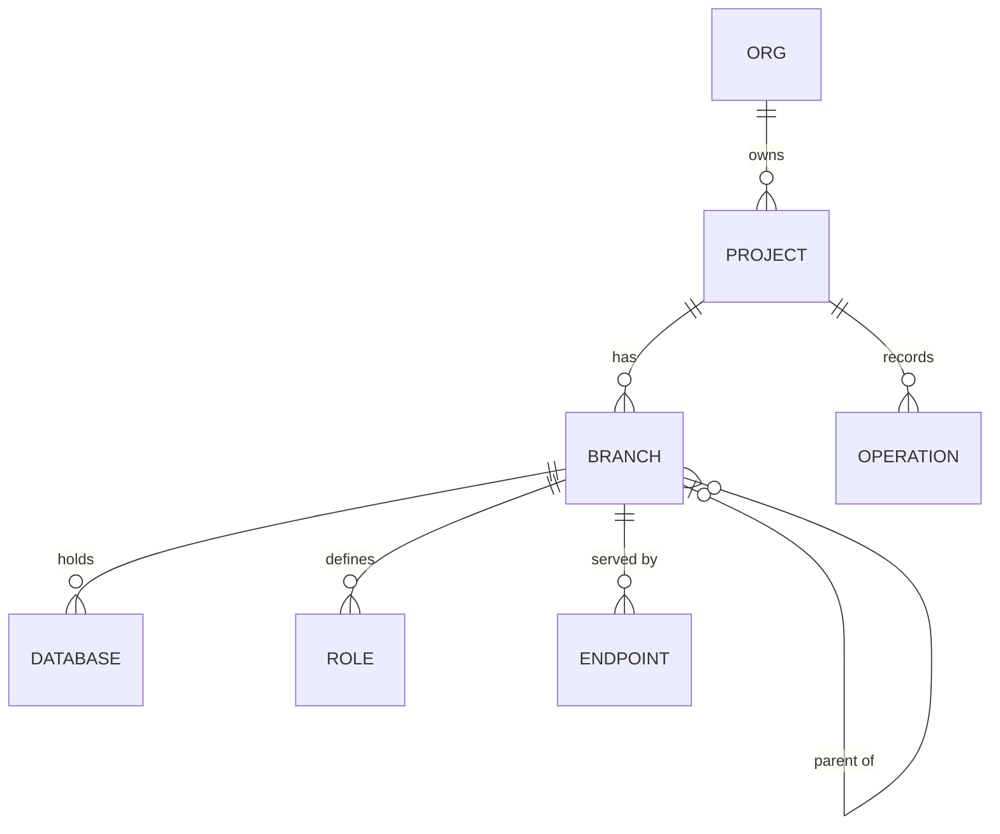

# Neon

`foac neon` talks to [Neon's API](https://neon.com/docs/reference/api). It
uses `NEON_API_KEY` or a credential saved by `foac auth neon login`. Every
command except `org list` and `project list` is scoped to one project: pass
`--project ID` anywhere after `neon`, or set `NEON_PROJECT_ID`. Neon requires
an organization ID on `project list` when the account belongs to an
organization: pass `--org ID` or set `NEON_ORG_ID`, finding IDs with
`org list`. Branches use IDs like
`br-...` and compute endpoints IDs like `ep-...`; `connection-uri` requires
`--database` and `--role` and prints a URI containing that role's password.

```sh
export NEON_API_KEY=napi_...
foac neon org list
foac neon project list --org org-123
foac neon branch create --project proj-1 --name preview
foac neon endpoint suspend ep-123 --project proj-1
foac neon connection-uri --project proj-1 --database app --role app_owner
foac neon --help
```

Neon list commands print `{"items":[...],"pageInfo":{...}}`; `project list`,
`branch list`, and `operation list` paginate with `--limit` and `--after`
using `pageInfo.endCursor`. Project, database, and role mutations are not
covered.

## Entity relationships

Entities exposed by the CLI and how they relate. `connection-uri` is not an
entity: it derives a URI from a project, database, and role, plus an
optional branch or endpoint.


