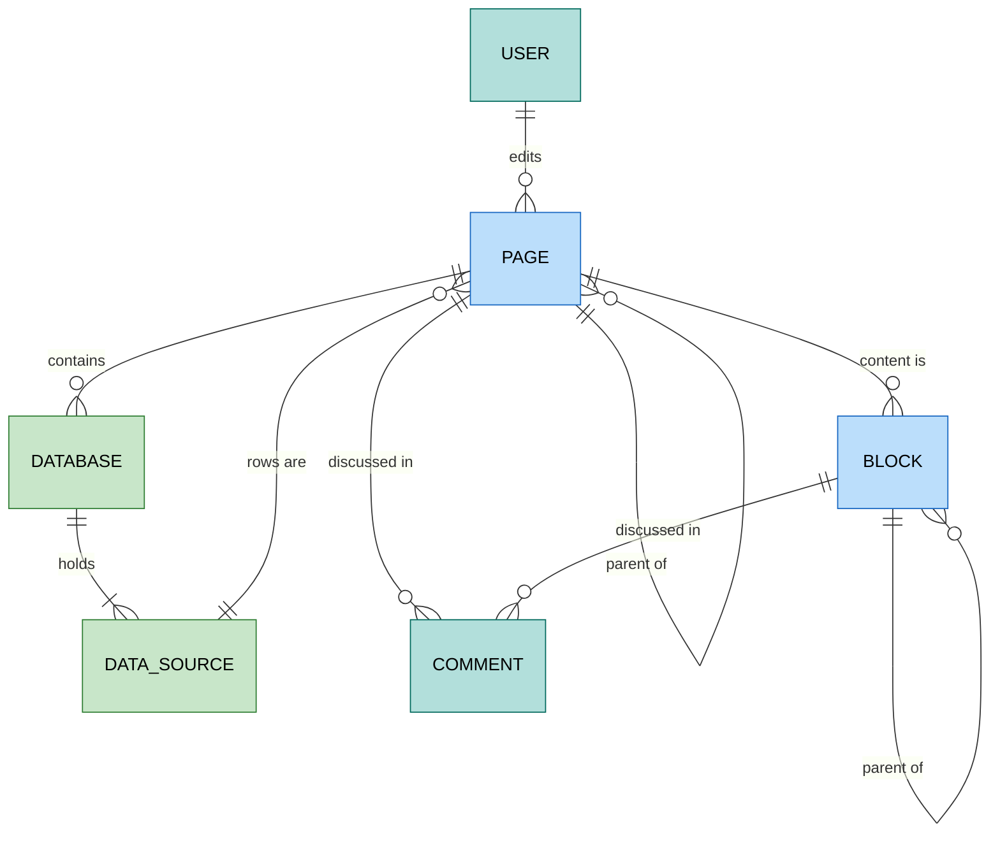

# Notion

`foac notion` talks to [Notion's API](https://developers.notion.com/reference/intro),
pinned to API version `2026-03-11`. It uses `NOTION_API_KEY` or a credential
saved by `foac auth notion login`: an internal integration secret or a
personal access token. An integration sees only the pages and databases shared
with it (page menu > Connections), so a 404 `object_not_found` usually means
the page is not shared.

Page content goes in and comes out as Notion's enhanced Markdown, through
Notion's own Markdown endpoints: `page get --markdown` reads it, and
`page create` and `page update` take `--body`/`--body-file`. An update body
replaces the whole page content. On create, a leading `# Heading` becomes the
page title and is dropped from the content (Notion's behavior). Blocks stay
Notion-native JSON (`block append --children`), and `--properties` takes
Notion's raw property-value object.

A database is a container of one or more data sources, and rows live in data
sources: `database get` lists `data_sources[].id`, which feeds
`data-source query` (raw `--filter` and `--sorts` JSON). A new row is
`page create --data-source ID`.

```sh
export NOTION_API_KEY=ntn_...
foac notion search "launch spec"
foac notion page get 1a2b3c4d5e6f47a8b9c0d1e2f3a4b5c6 --markdown
foac notion page create --parent 1a2b3c4d5e6f47a8b9c0d1e2f3a4b5c6 --title "Runbook" --body-file runbook.md
foac notion page update 1a2b3c4d5e6f47a8b9c0d1e2f3a4b5c6 --properties '{"Status": {"status": {"name": "Done"}}}'
foac notion database get 2b3c4d5e6f7a48b9c0d1e2f3a4b5c6d7
foac notion data-source query 3c4d5e6f7a8b49c0d1e2f3a4b5c6d7e8 --filter '{"property": "Done", "checkbox": {"equals": false}}'
foac notion block append 1a2b3c4d5e6f47a8b9c0d1e2f3a4b5c6 --children '[{"paragraph": {"rich_text": [{"text": {"content": "Hi"}}]}}]'
foac notion comment create --page 1a2b3c4d5e6f47a8b9c0d1e2f3a4b5c6 --body "Updated, see PR #42"
foac notion --help
```

Every list prints `{"items":[...],"pageInfo":{...}}` and paginates with
`--limit` (default 50, at most 100) and `--after` using `pageInfo.endCursor`.
`page list`, `data-source list`, and `search` are Notion's title search.
`page delete` moves the page to the trash. Personal access tokens cannot list
users.

Not covered: file uploads, views, database and data source schema changes,
block updates and deletes, and webhooks.

## Entity relationships

Entities exposed by the CLI and how they relate. A page is also a block: its
ID works wherever a block ID does.


