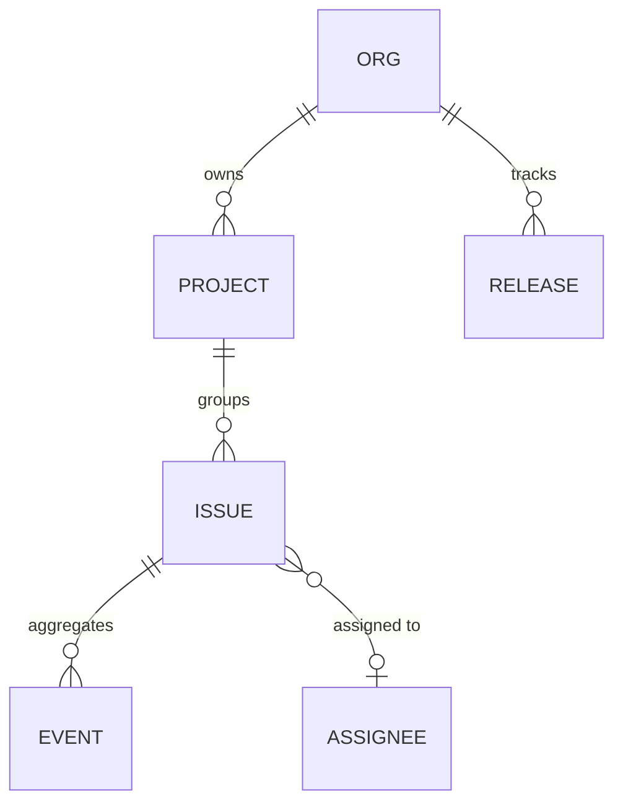

# Sentry

`foac sentry` talks to [Sentry's REST API](https://docs.sentry.io/api/). It
uses `SENTRY_AUTH_TOKEN` or a credential saved by `foac auth sentry login`.
Pass `--org SLUG` or set `SENTRY_ORG`. At an interactive terminal,
`foac auth sentry login` first asks for the Sentry hostname (default
`sentry.io`, always https; enter your own for a self-hosted instance) and
saves it alongside the token; piped logins read only the token, so pass
`--host sentry.example.com` to save a self-hosted instance non-interactively.
`SENTRY_URL` overrides the saved host. Issue commands accept numeric IDs
or short IDs like `PROJ-123`.

```sh
export SENTRY_AUTH_TOKEN=sntrys_...
foac sentry issue list --org acme --project backend --query "is:unresolved"
foac sentry issue latest-event PROJ-123 --org acme
foac sentry --help
```

Sentry list commands print `{"items":[...],"pageInfo":{...}}` and paginate
with `--cursor` using `pageInfo.nextCursor`. Releases are read-only; release
creation and sourcemap upload stay with `sentry-cli`.

## Entity relationships

Entities exposed by the CLI and how they relate. An assignee is a user or a
`#team-slug`; issues relate to releases only through search queries like
`release:1.2.0`, not a direct edge.


