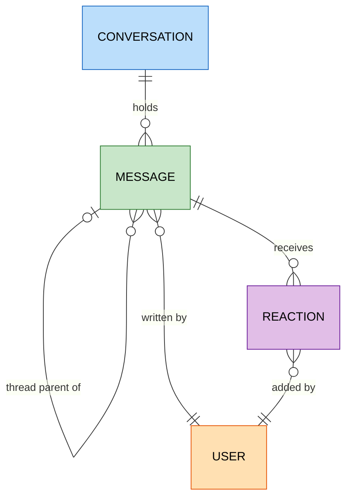

# Slack

`foac slack` talks to Slack's Web API and supports bot tokens, user tokens, or
both. Ordinary commands prefer `SLACK_BOT_TOKEN`, then a bot credential saved
by `foac auth slack login`, then `SLACK_USER_TOKEN`, then the stored user
credential. Message search prefers `SLACK_USER_TOKEN`, then the stored user
credential, because Slack's `search.messages` method does not accept bot tokens.
Conversation arguments accept IDs or names such as `#eng`; `user get` accepts
an ID, `@name`, display name, or email.

Several workspaces can be logged in at once as named instances:
`foac auth slack login --instance workb`, then `foac slack ... -i workb` (or
a `.foac.toml` `[defaults]` entry). A named instance uses only its stored
tokens — the environment variables above apply to the default instance only.
See [auth.md](auth.md).

| Available credentials | Ordinary commands | Search |
| --- | --- | --- |
| Bot only | Run as the app's bot | Unavailable |
| User only | Run as the installing user | Run as the installing user |
| Bot and user | Run as the app's bot | Run as the installing user |
| Neither | Slack is hidden from authenticated discovery | Unavailable |

`foac auth slack login` securely prompts for both token types, validates every
supplied token before changing the config, and stores them independently; leave
either prompt blank if it is not needed. With redirected stdin, supply the bot
token on the first line and user token on the second. `foac auth slack status`
accepts either token and reports the selected account's `token_type`. In a
user-only setup, actions are limited by that member's visibility and granted
user scopes, and writes are attributed to that member.

```sh
export SLACK_BOT_TOKEN=xoxb-...
export SLACK_USER_TOKEN=xoxp-...
printf '%s\n%s\n' "$SLACK_BOT_TOKEN" "$SLACK_USER_TOKEN" | foac auth slack login
foac slack conversation list
foac slack message create '#eng' --body "PR is up"
foac slack message list '#eng' --thread-ts 1724432400.123456
foac slack search 'deployment in:eng'
foac slack --help
```

Slack list and search commands print `{"items":[...],"pageInfo":{...}}` and
paginate with `--limit`/`--after` using `pageInfo.endCursor`. Long message text
accepts either `--body` or `--body-file`.

## Entity relationships

Entities exposed by the CLI and how they relate. Messages are identified by
the pair (conversation, `ts`); thread replies point at their parent message
via `thread_ts`.


