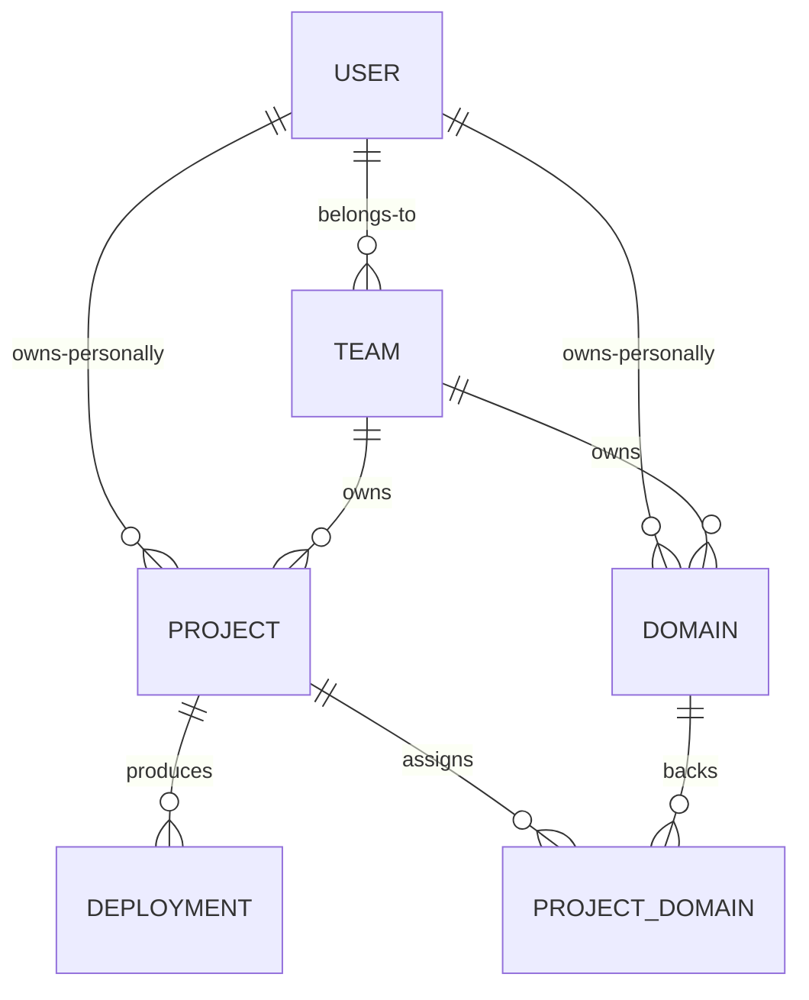

# Vercel

`foac vercel` talks to [Vercel's REST API](https://vercel.com/docs/rest-api).
It uses `VERCEL_TOKEN` or a credential saved by `foac auth vercel login`.
Create a token at <https://vercel.com/account/settings/tokens>. Commands use
the token's personal account by default; pass `--team team_...` anywhere after
`vercel`, or set `VERCEL_TEAM_ID`, for team-owned resources. Find IDs with
`team list`.

```sh
export VERCEL_TOKEN=...
foac vercel team list
foac vercel project list --team team_123 --search web
foac vercel project create --team team_123 --name web --framework nextjs
foac vercel deployment list --team team_123 --project web --state READY
foac vercel domain config example.com --project web
foac vercel project-domain create --project web preview.example.com --git-branch preview
foac vercel --help
```

List commands print `{"items":[...],"pageInfo":{...}}` and take `--limit`
plus `--after`; follow `pageInfo.endCursor` while `hasNextPage` is true. Vercel
normally returns millisecond timestamps as cursors. Project lists use Vercel's
`from` parameter while the other lists use `until`; foac keeps that API detail
behind the common `--after` flag.

Projects accept an ID or name, deployments use IDs (`deployment get` also
accepts a URL), and domains use DNS names. `domain` manages account ownership;
`project-domain` manages assignment to a project. Deployment creation and file
uploads, build/runtime logs, aliases, DNS records, project environment
variables, and team administration are deliberately not covered.


